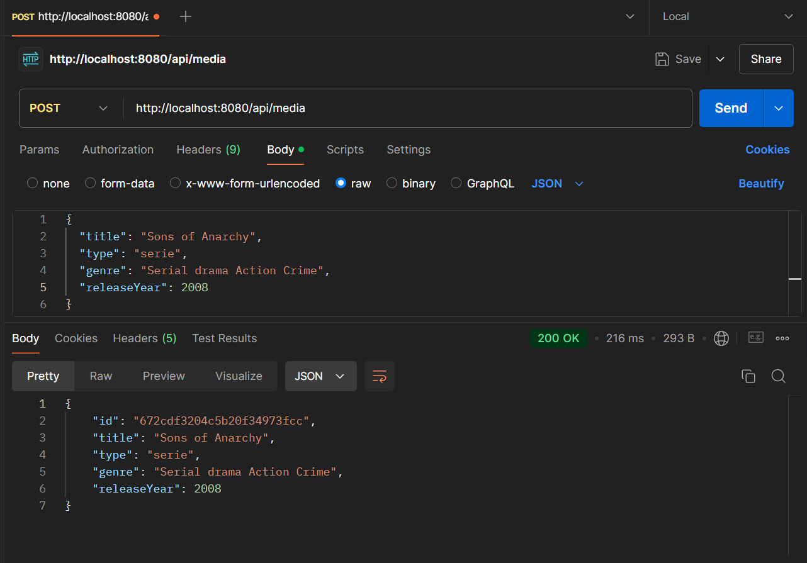
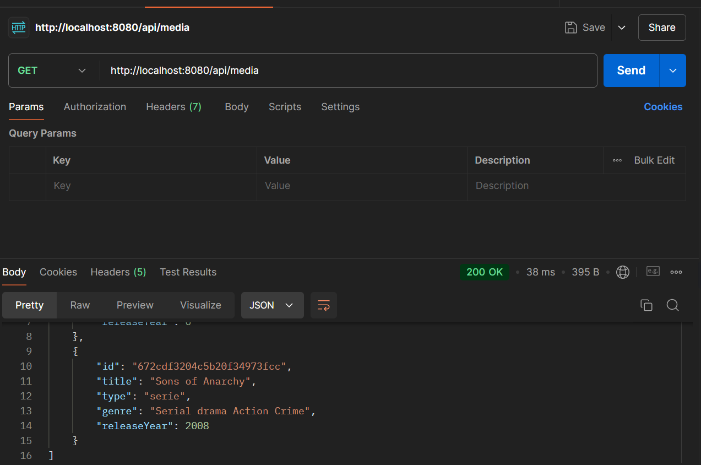
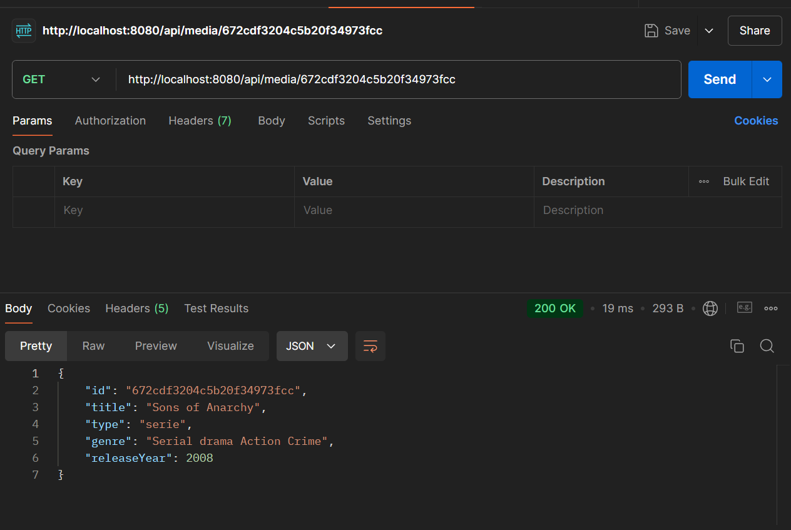
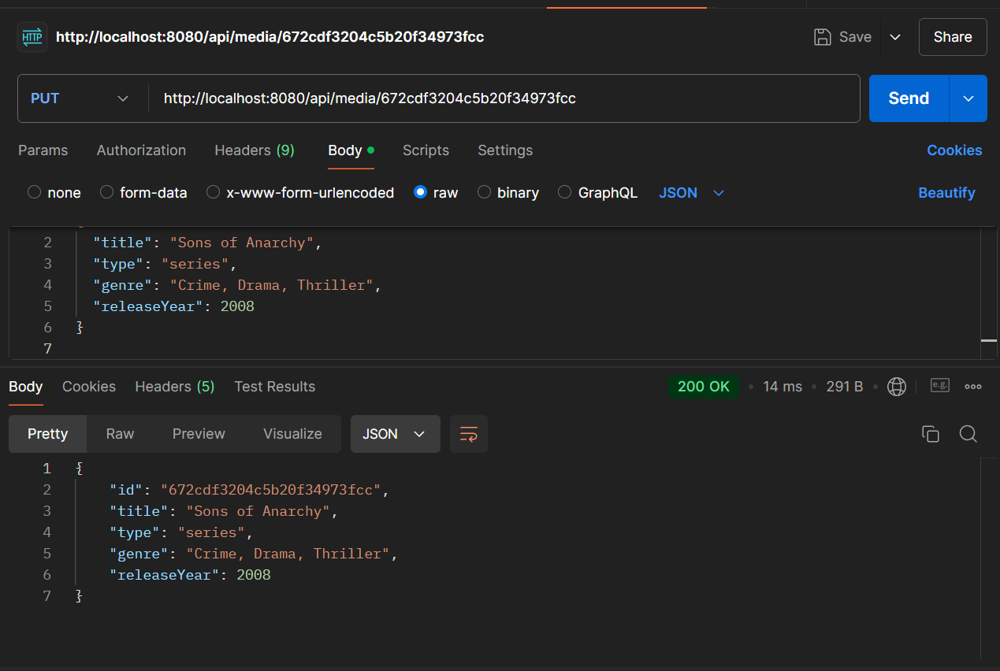
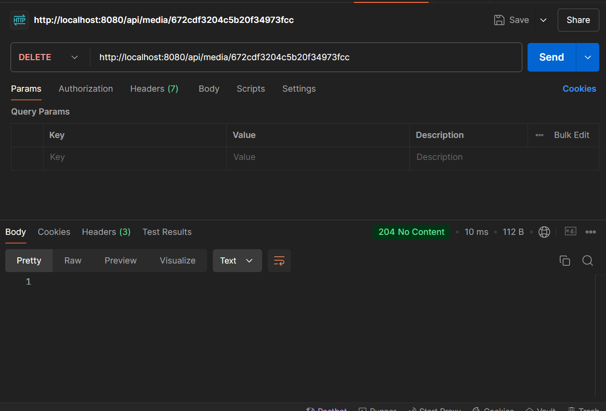
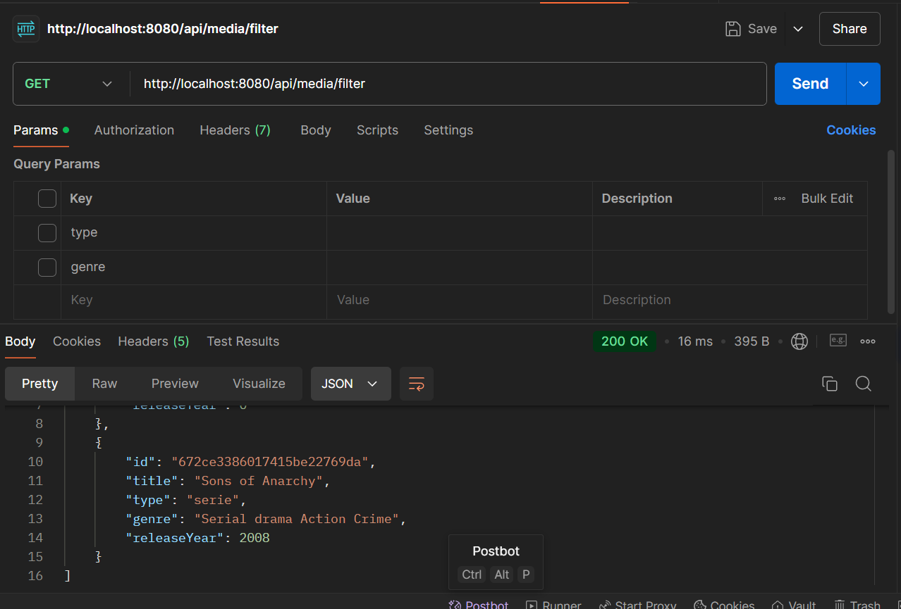
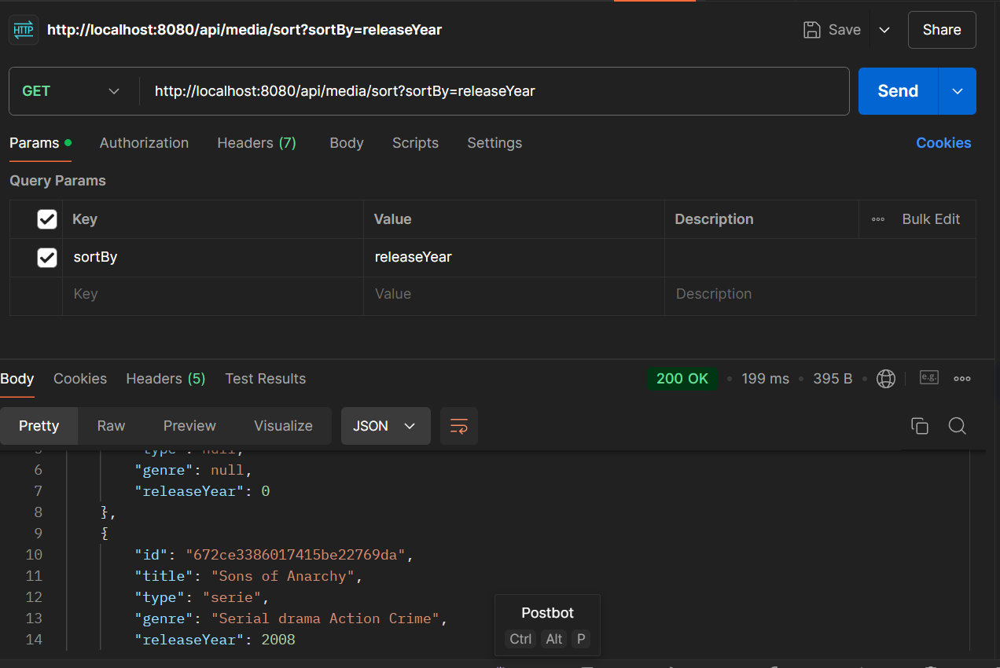
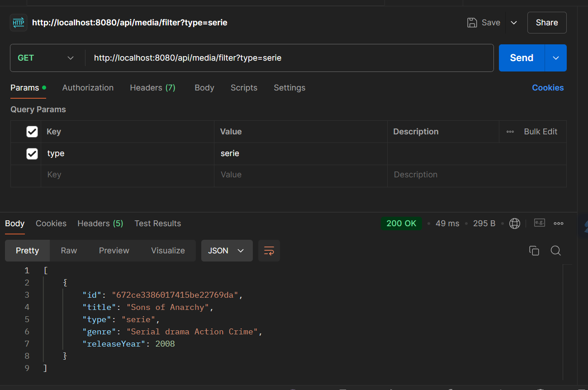

# Media API

This project is a **Media API** developed with **Java Spring Boot**.

## Project Overview

The Media API is designed to manage various types of media for example movies, music, or TV shows, with properties like title, type (movie, music, etc.), genre, and release year.

## API Access

[http://media-api-dns.northeurope.azurecontainer.io:8080/swagger-ui/index.html](http://media-api-dns.northeurope.azurecontainer.io:8080/swagger-ui/index.html)

## Steps I followed

## MongoDB Atlas Setup

Set up a MongoDB Atlas cluster and configured it to store media items.

## Application Development

- Created essential classes:
  - **Model** to define media item properties.
  - **Repository** for database interactions.
  - **Service** to handle business logic.
  - **Controller** to define API endpoints.

## Advanced Features

Implemented advanced features:

- **Filtering** to search media by criteria.
- **Sorting** to order results by fields like release year.
- **Pagination** to control the number of items per response.

## API Testing

All endpoints were tested successfully using **Postman**. See the screenshots below for examples of the tests:

## Documentation

- Added **Swagger** for API documentation, displaying all endpoints and providing an interactive UI.

## Application Configuration

- Updated `application.properties` with MongoDB Atlas credentials.
- Configured filtering, sorting, and pagination in the API endpoints.

## Deployment

Deployed the application in Azure using Docker and Azure Container Instances (ACI).

1. Created a Resource Group and Azure Container Registry.
2. Pushed the Docker image to Azure Container Registry.
3. Deployed the container to Azure Container Instances.
